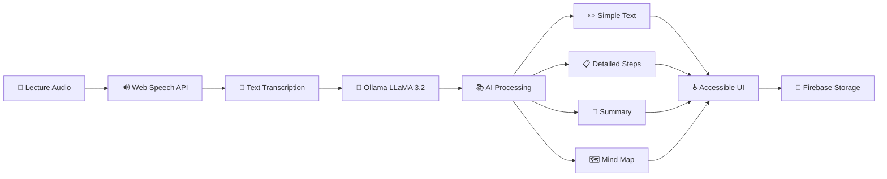

<div align="center">

# 🎓 SimplifiED

### AI-Powered Learning Assistant for Students with Dyslexia

*Making education accessible, one lecture at a time*

[](https://fastapi.tiangolo.com/)
[](https://react.dev/)
[](https://www.tensorflow.org/)
[](https://www.python.org/)
[](LICENSE)
[](https://github.com/VTG56/VoiceGuard-AI)

[Features](#-key-features) • [Demo](#-demo) • [Quick Start](#-quick-start) • [Tech Stack](#-technology-stack) • [Team](#-team)

</div>

---

## 🧠 Problem Statement

**Dyslexia** is a neurodevelopmental learning disorder affecting a student's ability to read, write, process, and comprehend text—despite having normal intelligence.

> 📊 **1 in 10 students** globally experience dyslexia or related learning difficulties

---

## 💡 Our Solution

**SimplifiED** is an AI-powered learning assistant that converts live classroom lectures into **multiple accessible learning formats** in real time, helping students—especially those with dyslexia—understand concepts in the way that works best for them.

### 🔒 Privacy-First Approach
All processing happens **locally using AI**, ensuring:
- ✅ Complete data privacy
- ✅ No cloud dependency
- ✅ Low cost operation
- ✅ Offline-friendly usage

---

## ✨ Key Features

<table>
<tr>
<td width="50%">

### 🎤 Live Lecture Processing
- Real-time speech-to-text transcription
- Instant conversion of spoken lectures
- Browser-based audio capture
- Continuous recording support

</td>
<td width="50%">

### 📚 Multiple Learning Formats
From a single lecture, get:
- **Simple Text** – Dyslexia-friendly explanations
- **Detailed Steps** – Step-by-step breakdowns
- **Summary** – Concise key takeaways
- **Mind Map** – Visual hierarchical structure

</td>
</tr>
<tr>
<td width="50%">

### ♿ Dyslexia-Friendly Design
- OpenDyslexic font for readability
- Clean spacing & reduced cognitive load
- High contrast color schemes
- Customizable text sizing

</td>
<td width="50%">

### 🌍 Multi-Language Support
- 🇬🇧 English
- 🇮🇳 Hindi
- 🇮🇳 Kannada
- Easy language switching

</td>
</tr>
<tr>
<td width="50%">

### 🎨 User-Friendly Interface
- 🌙 Dark & Light themes
- 📱 Fully mobile responsive (48px+ touch targets)
- 💻 Desktop, tablet & mobile support
- ⚡ Smooth animations with Framer Motion

</td>
<td width="50%">

### 🤖 Local AI Processing
- Uses **Ollama** with **LLaMA 3.2 (3B)**
- ❌ No API keys required
- ❌ No third-party data sharing
- ☁️ Firebase integration for secure storage

</td>
</tr>
</table>

---

## 🎬 Demo

---

## 🏗️ How It Works



### Architecture Flow

1. **Audio Input** – Live audio captured via browser
2. **Speech-to-Text** – Web Speech API converts audio to text
3. **AI Processing** – Ollama (LLaMA 3.2) generates multiple formats
4. **Accessible Display** – Rendered in dyslexia-friendly UI
5. **Data Storage** – Securely saved with Firebase (optional)

---

## 🛠️ Technology Stack

<table>
<tr>
<td align="center" width="33%">

### Frontend


</td>
<td align="center" width="33%">

### Backend


</td>
<td align="center" width="33%">

### Services


</td>
</tr>
</table>

#### Detailed Stack

**Frontend**
- React 19 – UI development
- Vite – Fast build tool
- Tailwind CSS – Responsive styling
- Framer Motion – Smooth animations
- Lucide React – Icon library
- Firebase SDK – Authentication & storage
- Web Speech API – Speech recognition

**Backend**
- Python 3.9+
- FastAPI – Modern API framework
- Uvicorn – ASGI server
- Ollama – Local LLM runtime
- LLaMA 3.2 (3B) – AI model
- Firebase Admin SDK – Backend auth

**Accessibility**
- OpenDyslexic – Dyslexia-friendly font
- Geom – Default UI font

---

## 🚀 Quick Start

### Prerequisites

- **Node.js** v18+
- **Python** v3.9+
- **Ollama** installed
- **Firebase** account

### One-Command Start (Windows)

```powershell
.\start.ps1
```

This automatically:
- ✅ Starts Ollama
- ✅ Runs FastAPI backend on port 8000
- ✅ Runs React frontend on port 5174

### Manual Start

#### 1️⃣ Install Dependencies

**Backend**
```bash
cd backend-python
pip install -r requirements.txt
```

**Frontend**
```bash
cd frontend
npm install
```

**Ollama Model**
```bash
ollama pull llama3.2:3b
```

#### 2️⃣ Start Services

**Backend**
```bash
cd backend-python
python -m uvicorn main:app --port 8000
```

**Frontend**
```bash
cd frontend
npm run dev
```

#### 3️⃣ Access Application

```
🌐 Frontend: http://localhost:5174
🔧 Backend:  http://localhost:8000
📚 API Docs: http://localhost:8000/docs
```

---

## 📁 Project Structure

```
simplifiED/
├── 📂 backend-python/          # FastAPI backend with Ollama
│   ├── main.py                 # API endpoints & AI processing
│   ├── requirements.txt        # Python dependencies
│   ├── .env.example           # Environment template
│   └── serviceAccountKey.json # Firebase credentials (gitignored)
│
├── 📂 frontend/                # React frontend with Vite
│   ├── 📂 src/
│   │   ├── 📂 components/     # Reusable components
│   │   │   ├── common/        # UI components
│   │   │   └── lecture/       # Lecture-specific components
│   │   ├── 📂 pages/          # Main pages
│   │   │   ├── Landing.jsx    # Landing page with team section
│   │   │   ├── Dashboard.jsx  # User dashboard
│   │   │   └── LecturePage.jsx # Recording & processing
│   │   ├── 📂 contexts/       # React contexts (Auth, Theme)
│   │   ├── 📂 services/       # API & Firebase services
│   │   └── firebase.js        # Firebase configuration
│   ├── 📂 public/             # Static assets
│   └── package.json
│
├── 📂 docs/                    # Documentation
│   ├── README.md
│   ├── QUICKSTART.md
│   ├── AUDIO_TRANSCRIPTION_SETUP.md
│   ├── MIGRATION_COMPLETE.md
│   ├── MULTILANGUAGE_FEATURE.md
│   ├── OLLAMA_PERFORMANCE_OPTIMIZATION.md
│   └── TTS_FEATURE.md
│
├── .gitignore
├── start.ps1                   # PowerShell startup script
└── start.bat                   # Batch startup script
```

---

## 🏆 Why SimplifiED Stands Out

<table>
<tr>
<td align="center" width="20%">
<h3>🎯</h3>
<b>Real Problem</b><br/>
Solves genuine accessibility challenges
</td>
<td align="center" width="20%">
<h3>♿</h3>
<b>Inclusive</b><br/>
Focused on education equity
</td>
<td align="center" width="20%">
<h3>🤖</h3>
<b>Privacy-First</b><br/>
Local AI processing
</td>
<td align="center" width="20%">
<h3>📱</h3>
<b>Production-Ready</b><br/>
Professional UI/UX
</td>
<td align="center" width="20%">
<h3>🚀</h3>
<b>Scalable</b><br/>
Schools, colleges & EdTech
</td>
</tr>
</table>

---

## 👥 Team

<div align="center">

### Code Lunatics

*Built with ❤️ for inclusive education*

</div>

---

## 📝 Documentation

- 📘 [Quick Start Guide](docs/QUICKSTART.md)
- 🎤 [Audio Transcription Setup](docs/AUDIO_TRANSCRIPTION_SETUP.md)
- 🌐 [Multi-Language Feature](docs/MULTILANGUAGE_FEATURE.md)
- ⚡ [Ollama Performance Optimization](docs/OLLAMA_PERFORMANCE_OPTIMIZATION.md)
- 🔊 [Text-to-Speech Feature](docs/TTS_FEATURE.md)

---

## 🤝 Contributing

We welcome contributions! Please see our [Contributing Guidelines](CONTRIBUTING.md) for details.

---

## 📄 License

© 2025 Code Lunatics Team. All rights reserved.

This project is licensed under the MIT License - see the [LICENSE](LICENSE) file for details.

---

<div align="center">

### ⭐ Star us on GitHub!

If SimplifiED helps make education more accessible, consider giving us a star!

[](https://github.com/VTG56/VoiceGuard-AI)

**Made with 💙 for students who learn differently**

</div>
